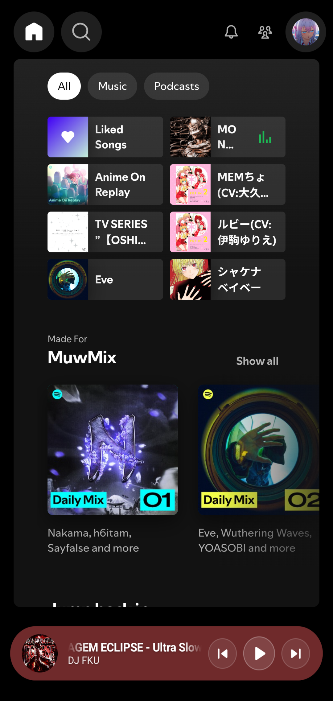
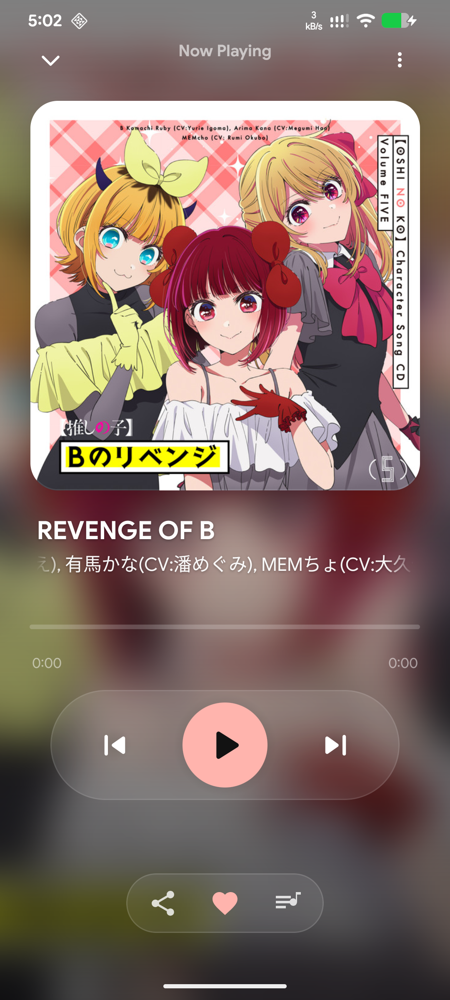
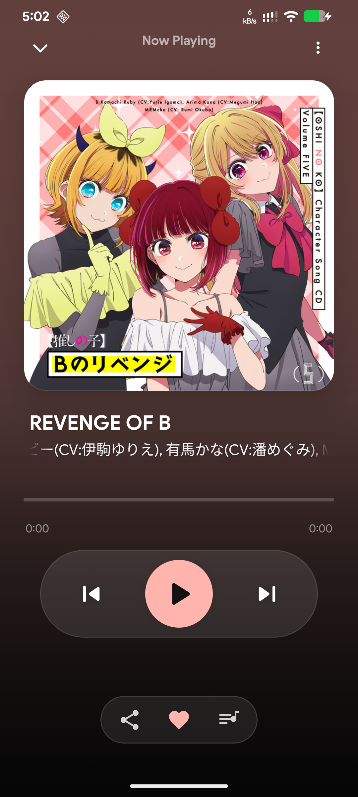
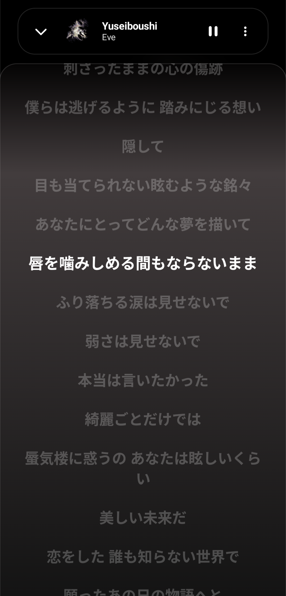

# Spot Player🎵

  <strong>A beautiful and lightweight Android music player built with Jetpack Compose</strong> 
  A premium, distraction-free player experience built on top of a customized web engine.

  
  
  
  

    
    
    

---

## ✨ Features

* **Flawless Background Play** — Audio streams smoothly when the app is minimized or the screen is locked. The system won't kill the playback.
* **Persistent Session** — Keeps you logged into your account securely without unexpected or random logouts.
* **No Advertisements** — Built-in ad-blocking engine automatically skips audio ads and removes visual banners on the fly.
* **Responsive Media Controls** — Fully integrates with the Android system notification drawer, lock screen controllers, and system media widgets for easy track switching.
* **Immersive Visuals** — The interface automatically extracts colors from the track artwork and adapts the background theme dynamically.
* **Synchronized Lyrics** — Built-in support for scrolling lyrics with click-to-seek navigation (jump to any part of the song by tapping a line).

---

## 🚀 Future & Updates

This is a personal, independent project. New features, bug fixes, and stability improvements will be released progressively whenever the developer has free time.

---

## 📥 Download & Installation

The application is distributed as a ready-to-use APK exclusively through the official community channel.

1. Open the [Telegram Channel](https://t.me/spot_app_player) or [Mega drive](https://mega.nz/file/V2YjmJbC#HHuQJXS_PNNT5K79isO-vk5FrZT_jGt3mDZBk_yPc0A).
2. Download the latest compiled `.apk` file from the pinned messages.
3. Allow installation from unknown sources in your device settings if prompted, and install the app.

---

## 🔒 Disclaimer

This is a third-party application developed for educational and personal customization purposes. It acts as a custom browser wrapper around publicly accessible web interfaces.

* The app does not modify server-side data, bypass authentication barriers, or violate standard network protocols.
* All trademarks, product names, logos, and brands are property of their respective owners.

---

  Made with ❤️ for premium mobile playback experience

